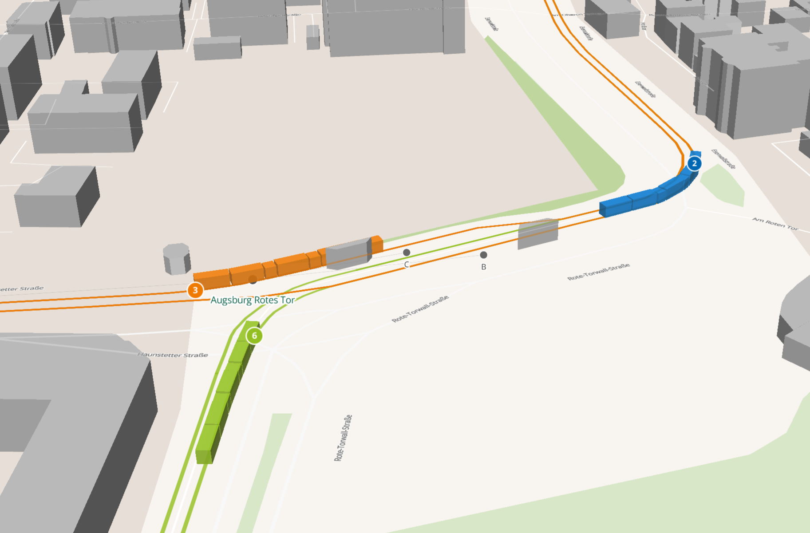
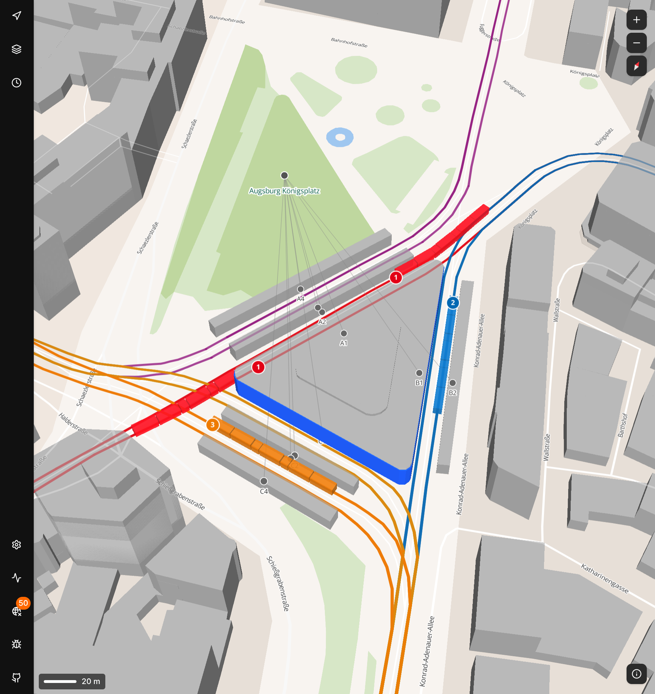

# Omniviv

A real-time public transport visualization platform.

## Screenshots





## Features

### Working

-   Real-time tram tracking with smooth position interpolation
-   3D map visualization with extruded buildings
-   WebSocket-based live vehicle updates
-   Multiple tram lines with distinct colors
-   Station and platform markers with labels
-   Dark/light mode support
-   Context menu (copy coordinates, measure distance)

### Partially Working

-   **Collision avoidance**: Basic implementation exists but not fully reliable
-   **Rendezvous blinking**: Flashes green when trams are about to depart (timing may need tuning)

### Planned / Not Yet Implemented

-   End of line rotation (vehicle turnaround animation at terminus)
-   Support for all vehicle types (buses, trains, ferries, etc.)
-   Realistic 3D vehicle models at closer zoom levels
-   Dark mode for map tiles/style
-   3D terrain with underground tunnel visualization
-   Day/night cycle and weather visualization
-   Navigation routing between points
-   Offline map with cached planned timetables
-   Pin stations to sidebar for quick access
-   "Leave now" traffic light indicator for optimal departure timing
-   First-person driver's seat view for vehicles
-   Multiple city/area support
-   General map improvements (POIs, local events, etc.)
-   Historical data and statistics

## Architecture

-   **API**: Rust-based backend using Axum
-   **Web**: React frontend with MapLibre GL
-   **Deployment**: docker compose with mpm compose

## Quick Start

### Using Docker Compose

Requires [mpm](https://github.com/my-own-web-services/mows/tree/main/utils/mpm) for deployment:

```bash
# Install mpm
curl -fsSL https://raw.githubusercontent.com/my-own-web-services/mows/main/utils/mpm/scripts/install.sh | bash

# Clone and deploy
git clone https://github.com/firstdorsal/omniviv.git
cd omniviv/deployment
nano values.yaml  # Configure as needed
mpm compose up
```

See [docs/deployment.md](docs/deployment.md) for detailed deployment instructions.

### Development

**API:**

```bash
cd api
cargo run
```

**Web:**

```bash
cd web
pnpm install
pnpm dev
```

## Documentation

See the [docs](docs/) folder for detailed documentation.

## Docker Images

Docker images are automatically built and published to GitHub Container Registry:

-   `ghcr.io/firstdorsal/omniviv-api`
-   `ghcr.io/firstdorsal/omniviv-frontend`

See [docs/releasing.md](docs/releasing.md) for the full release workflow.

## License

[Add license information here]
